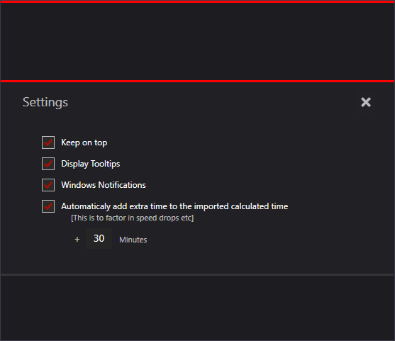

# Solaris

## About >
Simple download time calculator with built in auto shutdown/reboot timer

## Framework & library dependencies >
MahApps.Metro > https://github.com/MahApps/MahApps.Metro  
MahApps.Metro.IconPacks.Material > https://github.com/MahApps/MahApps.Metro.IconPacks     
Microsoft.Toolkit.Uwp.Notifications > https://github.com/CommunityToolkit/WindowsCommunityToolkit/tree/main/Microsoft.Toolkit.Uwp.Notifications  

Main UI ..  

More ..  
   